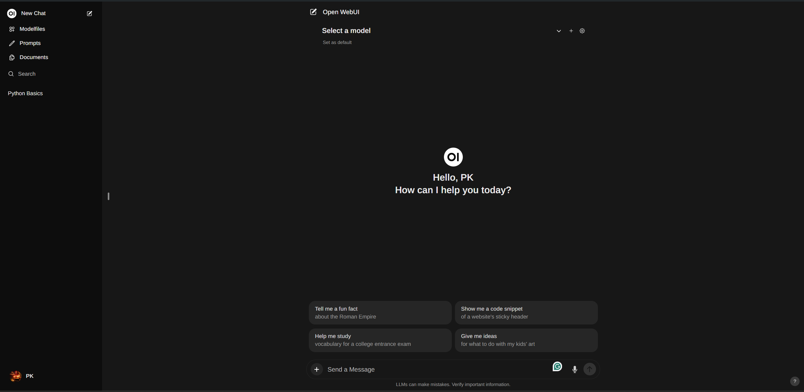

# Private GPT

This is private chatGPT model that can use locally, and this project create based on ollama and open-webui

### How to start 
* Runs on CPU.
* This will start two containers that runs ollama container for store models other runs open webui for frontend.
~~~sh
docker-compose -f ./Docker/docker-compose.yml up -d 
~~~

### How to download models
* You can download models from ollama "https://ollama.com/library" to ollama container.
* 

 

---

 

### GUI

